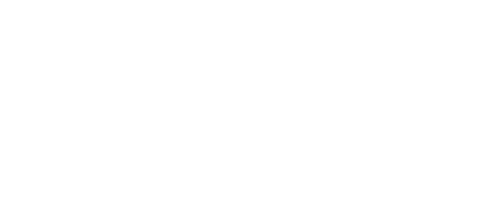

# ToDo List N-Tier App

Ce projet est une application ToDo List complète, organisée en architecture N-Tiers, avec un backend Node.js/TypeScript, un frontend React/TypeScript, un proxy, et une orchestration via Docker Compose.

## Architecture du projet



- **ToDoListFrontEnd** : Application React/TypeScript, UI moderne avec Tailwind CSS, gère l'affichage et l'interaction utilisateur.
- **Proxy** : Sert d'intermédiaire entre le frontend et le backend, gère la sécurité, le routage, etc.
- **ToDoListBackend** : API REST Node.js/TypeScript, gère la logique métier, la persistance des tâches, etc.
- **Database** : Stocke les tâches (PostgreSQL).

## Démarrage rapide

1. **Prérequis** :

   - Docker & Docker Compose
   - Node.js (pour développement local)
   - Make

2. **Lancer avec Docker Compose** :

Le projet propose plusieurs commandes via le `Makefile` pour faciliter les opérations courantes :

| Commande        | Description                                       |
| --------------- | ------------------------------------------------- |
| `make build`    | Build tous les services Docker                    |
| `make up`       | Démarre tous les services Docker                  |
| `make down`     | Arrête tous les services Docker                   |
| `make electron` | Lance le client lourd (voir prérequis ci-dessous) |

> Pour utiliser ces commandes, assurez-vous d'avoir `make` installé sur votre système.

## Lancer le client lourd (Electron)

### Prérequis

- Node.js >= 18
- npm ou yarn

### Installation et lancement

1. Installez les dépendances :
   ```sh
   npm install
   ```
2. Lancez le client lourd Electron :

   ```sh
   npm run electron
   ```

   ou

   ```sh
   make electron
   ```

Le client lourd s'ouvrira dans une nouvelle fenêtre.
